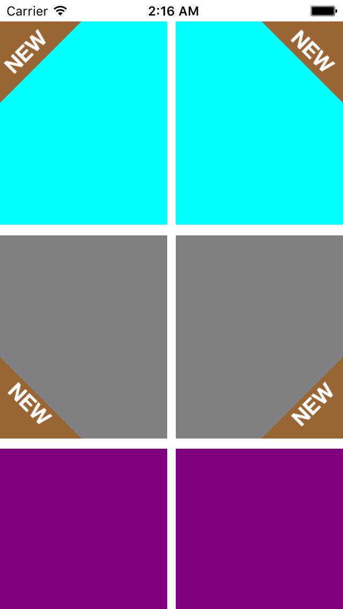
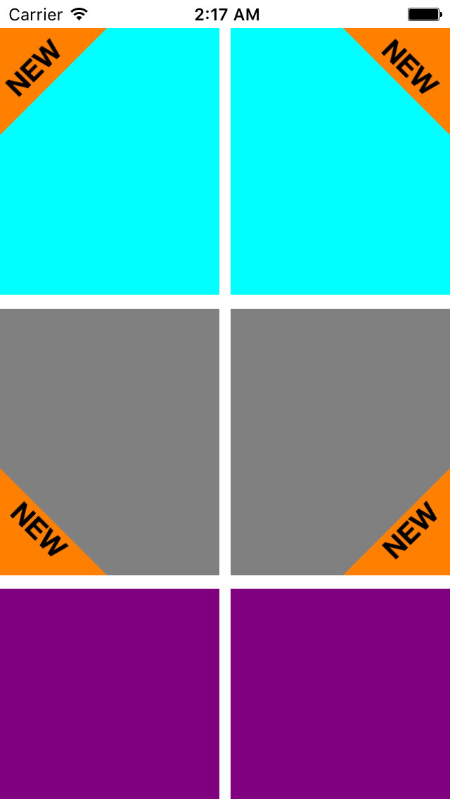

# TriLabelView

# A triangle shaped corner label view for iOS written in Swift.

* This view is a subclass of UIView.
* It can be created and customized from the Storyboard or from the code.

<br>
<br>




## Setup with Cocoapods

If you are using Cocoapods add this text to your Podfile
and run `pod install`.

    use_frameworks!
    target 'Your target name'
    pod 'TriLabelView'

##Usage

### Creating a view from the code

```Swift
let triLabelView = TriLabelView(frame:CGRect)
view.addSubview(triLabelView)
```

#### Customization
```Swift
// Change Text
triLabelView.text = "NEW"

// Adjust Length Percentage
// You can update this to set percentage value of this
// view to that of the superview.
// Default value is 50.0
triLabelView.lengthPercentage = 60.0
```

You can set the position of view with `.TopLeft` being the default. The following positions are available
```Swift
public enum Position:String {
    case TopLeft
    case TopRight
    case BottomRight
    case BottomLeft
}
```
