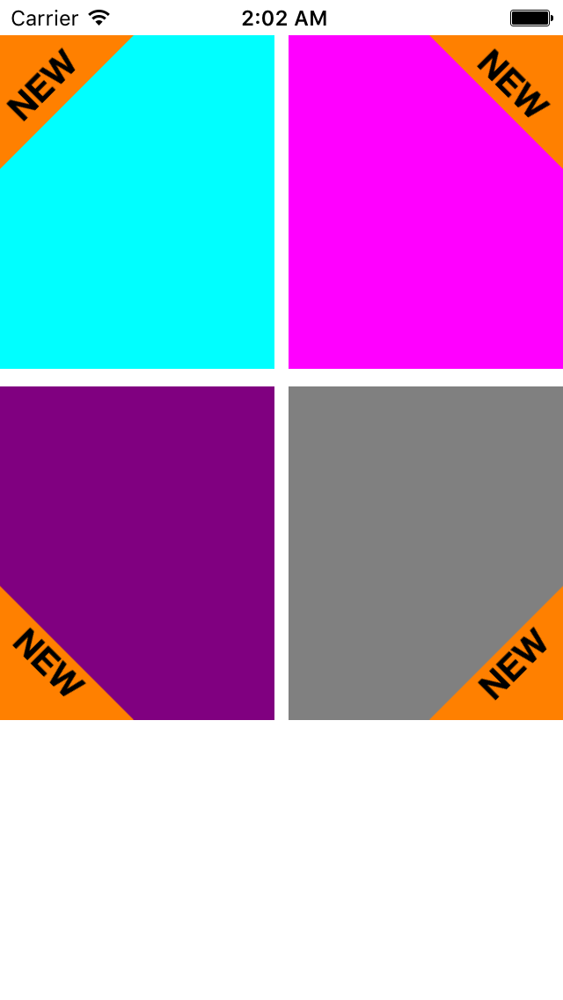

# TriLabelView

# A triangle shaped corner label view for iOS written in Swift.

* This view is a subclass of UIView.
* It can be created and customized from the Storyboard or from the code.

<br>
<br>



## Setup with Cocoapods

If you are using Cocoapods add this text to your Podfile
and run `pod install`.

    use_frameworks!
    target 'Your target name'
    pod 'TriLabelView'

##Usage

### Creating a view from the

```Swift
let triLabelView = TriLabelView(frame:CGRect)
view.addSubview(triLabelView)
```
